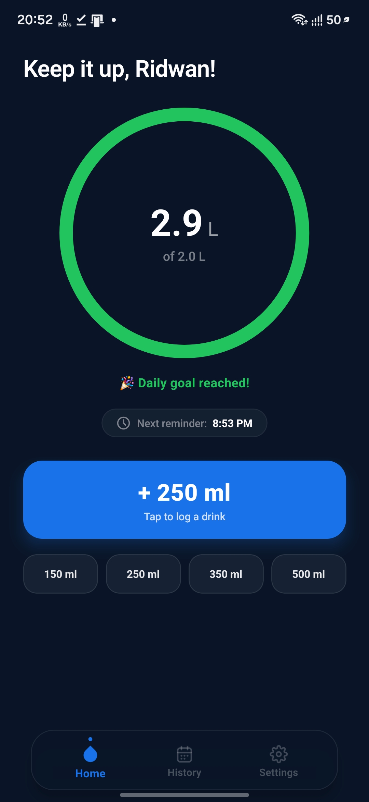
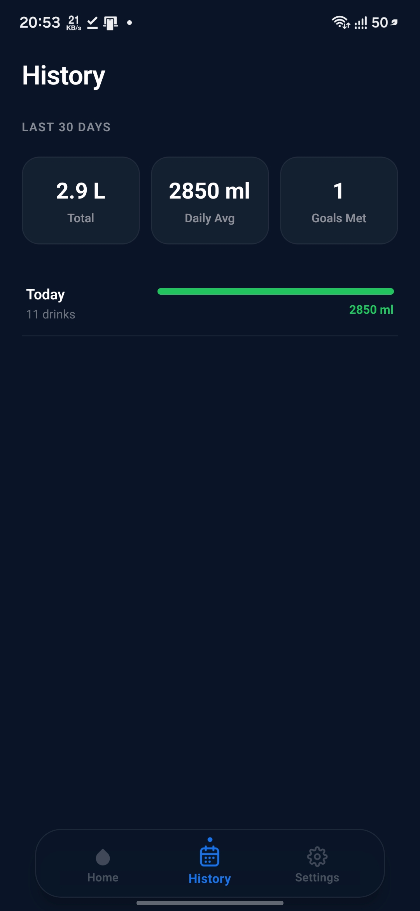
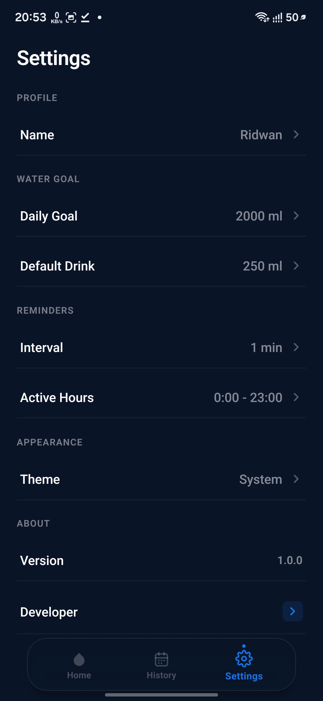

# 💧 Bindu

A minimal, calm Android hydration companion that helps you build a consistent water-drinking habit.

Bindu is a daily water tracking app that combines smart reminders, progress visualization, and a clean interface to make staying hydrated effortless. This is my first AI-assisted mobile development project, built to explore modern React Native patterns while solving a real everyday problem.

[](https://reactnative.dev/)
[](https://expo.dev/)
[](https://www.typescriptlang.org/)
[](./LICENSE)

---

## Preview


<p align="center">
  
  &nbsp;&nbsp;&nbsp;&nbsp;
  
  &nbsp;&nbsp;&nbsp;&nbsp;
  
</p>


## Why Bindu?

Most water reminder apps are cluttered with ads, gamification, or unnecessary features. I wanted something different: a calm, distraction-free tool that simply helps you remember to drink water.

Bindu focuses on the essentials—track your intake, get gentle reminders during your active hours, and see your progress at a glance. No subscriptions, no bloat, just hydration tracking done right.

This project also served as my introduction to mobile development using Expo and React Native, with guidance from AI tools to explore best practices in component architecture, state management, and native features like notifications.

---

## Features

### Core Functionality
- **One-Tap Water Logging** — Quick-add buttons for 150ml, 250ml, 350ml, and 500ml
- **Animated Progress Ring** — Visual feedback with smooth SVG animations and color-coded progress
- **Smart Daily Goal** — Customizable target intake (1.5L to 4.0L presets)
- **Personalized Greetings** — Time-aware messages that adapt to morning, afternoon, evening, and night

### Reminders & Notifications
- **Local Notification System** — Daily recurring reminders during your active hours
- **Interactive Actions** — "Drink" button logs water without opening the app; "Snooze" delays reminder by 10 minutes
- **Flexible Scheduling** — Set custom intervals (30–180 minutes) and active hours (e.g., 8 AM–10 PM)
- **Notification Variety** — 6 rotating reminder messages, including a Bangla greeting

### Data & History
- **30-Day History** — View total intake, daily average, and goal completion stats
- **Persistent Storage** — All data saved locally with AsyncStorage
- **Daily Progress Tracking** — See intake breakdown by date with mini progress bars

### User Experience
- **Smooth Onboarding** — 4-step setup flow to personalize your experience
- **Custom Tab Bar** — Floating pill-shaped navigation with animated transitions
- **Animated Splash Screen** — Custom water drop animation on launch
- **Dark Theme** — Designed with a calming navy-and-blue color palette

---

## Tech Stack

| Technology | Purpose |
|------------|---------|
| **React Native 0.86** | Cross-platform mobile UI framework |
| **Expo SDK 57** | Development toolchain and native modules |
| **TypeScript 6.0** | Type-safe application logic |
| **React Navigation 7** | Tab and stack navigation with custom animations |
| **AsyncStorage** | Local data persistence (settings, logs, setup state) |
| **expo-notifications** | Local notification scheduling and interactive actions |
| **react-native-svg** | Vector graphics for icons and progress ring |
| **react-native-reanimated** | Performant animations for UI transitions |

---

## Project Architecture

```
Bindu/
├── App.tsx                      # Root component with splash/setup routing
├── app.json                     # Expo configuration and Android permissions
├── eas.json                     # EAS Build profiles (dev/preview/production)
├── assets/                      # App icons, splash screen, adaptive icons
├── src/
│   ├── navigation/
│   │   └── AppNavigator.tsx     # Tab and setup stack navigators
│   ├── screens/
│   │   ├── SplashScreen.tsx     # Animated splash with water drop
│   │   ├── HomeScreen.tsx       # Main dashboard with progress ring
│   │   ├── HistoryScreen.tsx    # 30-day log with statistics
│   │   ├── SettingsScreen.tsx   # Goal, intervals, theme, about
│   │   └── setup/               # 4-step onboarding flow
│   ├── hooks/
│   │   ├── useSettings.ts       # Settings persistence hook
│   │   ├── useWaterLog.ts       # Daily intake tracking hook
│   │   └── useNotifications.ts  # Notification lifecycle management
│   ├── services/
│   │   ├── storage.ts           # AsyncStorage abstraction layer
│   │   ├── notifications.ts     # Notification scheduling and actions
│   │   ├── greetingUtils.ts     # Time-aware greeting generator
│   │   └── reminderUtils.ts     # Next reminder display logic
│   ├── theme/
│   │   ├── colors.ts            # Light/dark color palettes
│   │   └── typography.ts        # Font scales and text styles
│   └── types/
│       └── index.ts             # TypeScript type definitions
└── BUILD_GUIDE.md               # EAS Build instructions
```

---

## Installation

### For Users
Download the latest APK from the [Releases](https://github.com/ridwanrafiii/Bindu/releases) page and install it on your Android device.

> **Note:** You may need to enable "Install from unknown sources" in your Android settings.

### For Developers

**Prerequisites:**
- Node.js 18+ and npm
- Expo CLI (`npm install -g expo-cli`)
- Android Studio (for Android emulator) or a physical device

**Setup:**

```bash
# Clone the repository
git clone https://github.com/ridwanrafiii/Bindu.git
cd Bindu

# Install dependencies
npm install

# Start the development server
npx expo start
```

**Building APK:**

```bash
# Install EAS CLI
npm install -g eas-cli

# Log in to your Expo account
eas login

# Build preview APK
eas build -p android --profile preview
```

See [BUILD_GUIDE.md](./BUILD_GUIDE.md) for detailed build instructions.

---

## Configuration

Key settings are stored in `app.json`:

- **Android Permissions:** `POST_NOTIFICATIONS`, `SCHEDULE_EXACT_ALARM`, `RECEIVE_BOOT_COMPLETED`, `VIBRATE`
- **Notification Channel:** High importance, blue LED (#1A73E8), vibration enabled
- **Theme:** Automatic UI style (follows system preference for status bar)

Notification behavior is configured in `src/services/notifications.ts`, including:
- Daily trigger recalculation on settings change
- Two action buttons: "Drink" and "Snooze (10m)"
- Six rotating notification messages

---

## Known Limitations

- **Theme Switching:** While light/dark color palettes are defined in `src/theme/colors.ts`, the app currently hardcodes dark theme colors in UI components. The theme setting in Settings screen is stored but not dynamically applied.
- **Platform Support:** Primarily designed and tested for Android. iOS configuration exists but has not been built or tested.
- **Empty Utility File:** `src/services/dateUtils.ts` exists but contains no code (date utilities were integrated into `storage.ts` instead).

---

## Future Improvements

- Dynamic light/dark theme switching based on user preference
- iOS build and testing
- Weekly/monthly statistics charts
- Reminder notification sound customization
- Export data to CSV
- Widget support for at-a-glance progress

---

## Development Notes

This project was built with assistance from AI coding tools (Claude Code) to explore:
- Expo SDK 57 and EAS Build workflows
- Local notification scheduling with `expo-notifications`
- AsyncStorage patterns for multi-key data persistence
- Custom React Navigation tab bars
- SVG animations with `react-native-reanimated`

The architecture prioritizes simplicity and readability over abstraction—hooks are colocated with features, services are single-purpose, and components are defined inline with screens where it makes sense.

---

## License

MIT License

Copyright (c) 2015-present 650 Industries, Inc. (aka Expo)

See [LICENSE](./LICENSE) for full text.

---

## Author

**Ridwanur Rahman Rafi**  
Email: ridwanurrahmanrafi@gmail.com

---

## Acknowledgments

Built with [Expo](https://expo.dev/), [React Native](https://reactnative.dev/), and guidance from [Claude Code](https://claude.ai/claude-code).
